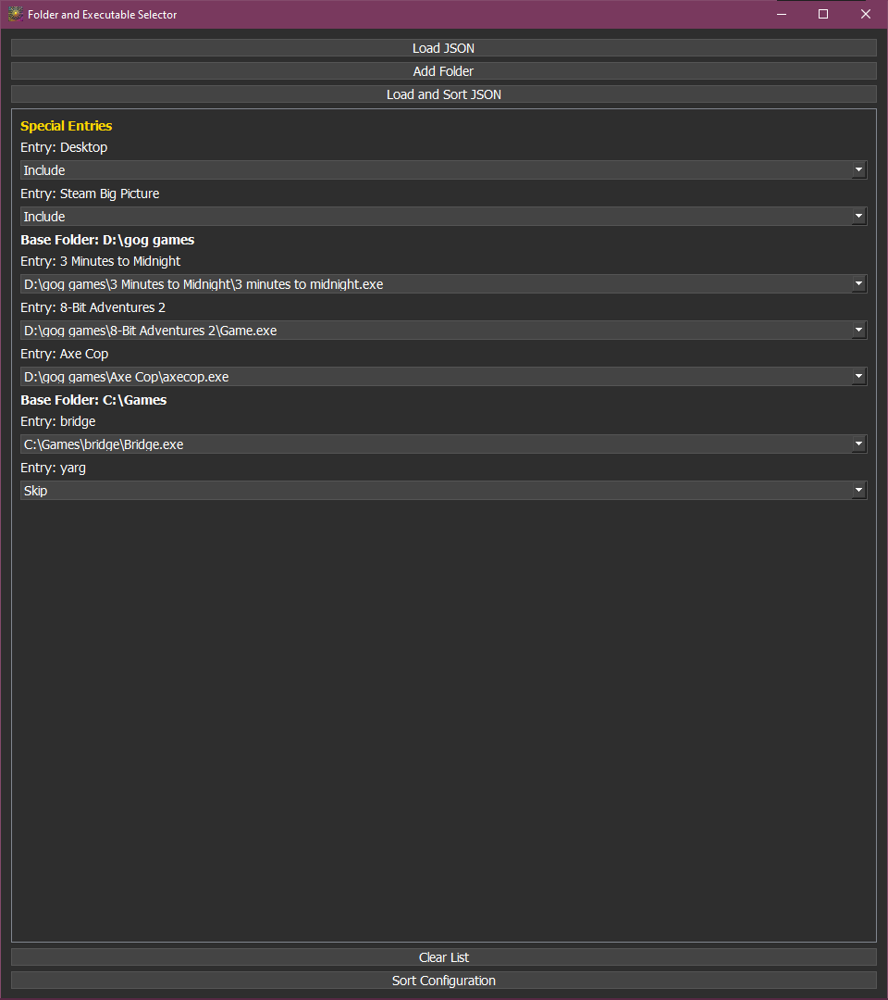
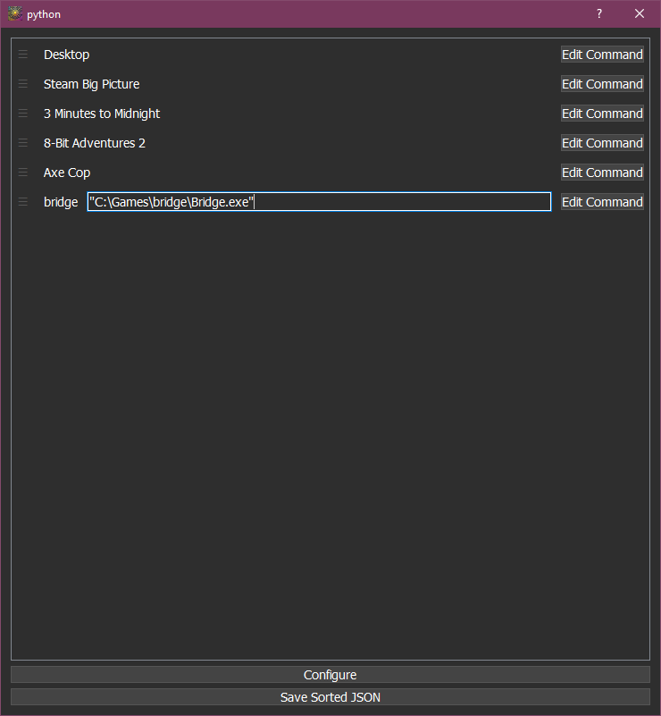

# NeonSunshine
Program to add games to a JSON in sunchine's `app.json` format.

Just makes a `.json` with your selected EXE files sorted how you want.

## Screenshots

### Folder and Executable Selector

### Sort JSON Entries

